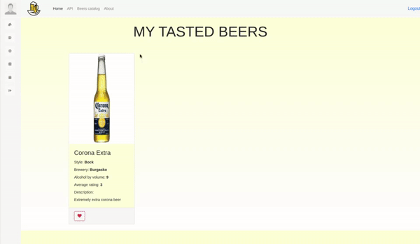
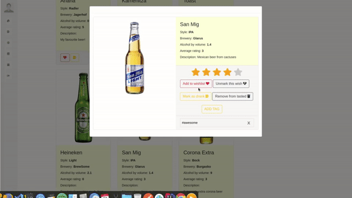

# Beer Tag

**Project description**

BEER TAG enables users to manage all the beers that they have drank and want to drink.
Each beer has detailed information about it from the ABV (alcohol by volume) to the style and description.
Data is community driven and every beer lover can add new beers and edit missing information on already existing ones.
All beers are listed and can be sorted by rating, ABV, alphabetically. The list can be filtered by tags,
style, origin country.
There is master-details view that shows beer details when one is selected.
Also, BEER TAG allows them to rate a beer and calculates average rating from different users.

*Public Part*

The public part of our project is visible without authentication. This includes the
application start page, the user login and user registration forms, as well as list of all beers that have
been added from different users. People that are not authenticated cannot see any user specific
details, neither they can interact with the website, they can only browse the beers and see list and
details of them.

*Private Part (Users only)*

Registered users have private part in the web application accessible after successful login.
The web application provides them with UI to add/edit/delete (CRUD) beers.
The app have profile page that shows user’s photo and name from their contact on the
device and their top 3 most ranked beers, they’ve tasted.

*Administration Part*

System administrators have administrative access to the system and permissions to
administer all major information objects in the system, e.g. to create/edit/delete (CRUD) users and
other administrators, to edit/delete beers and related data if they decide to.

*REST API*
A REST API is provided.
The REST API leverages HTTP as a transport protocol and clear text JSON for the request and
response payloads. It is integrated with Swagger.

*Tech stack*

*Backend*
* The used language is Java 8
* Used tiered project structure (separated application components in 3 layers - repositories, services and controllers)
* Used SpringMVC and SpringBoot framework
* For Persistence is used MySQL/MariaDB
* Used Hibernate in the Persistence layer
* Used Spring Security to handle user registration and user roles

*Frontend*
* Used Spring MVC Framework with Thymeleaf template engine for generating views
* Used Javascript and JQuery for working with the DOM tree and filling the views with data
* Used AJAX for making asynchronous requests to the server, where needed.

*UI*
* Overview of the home page

* Overview of the REST API Documentation, integrated with Swagger

* Unauthorized view of the beer catalog with sorting and filtering functionality and details view

* Authorized user sidebar and beer creation view

* Authorized user beer details and rating + favourites functionality

* Authorized user beer details and add/remove tag functionality

* Authorized user beer details and My beers view

* Authorized user beer details and Wishlist/Drank beers view

